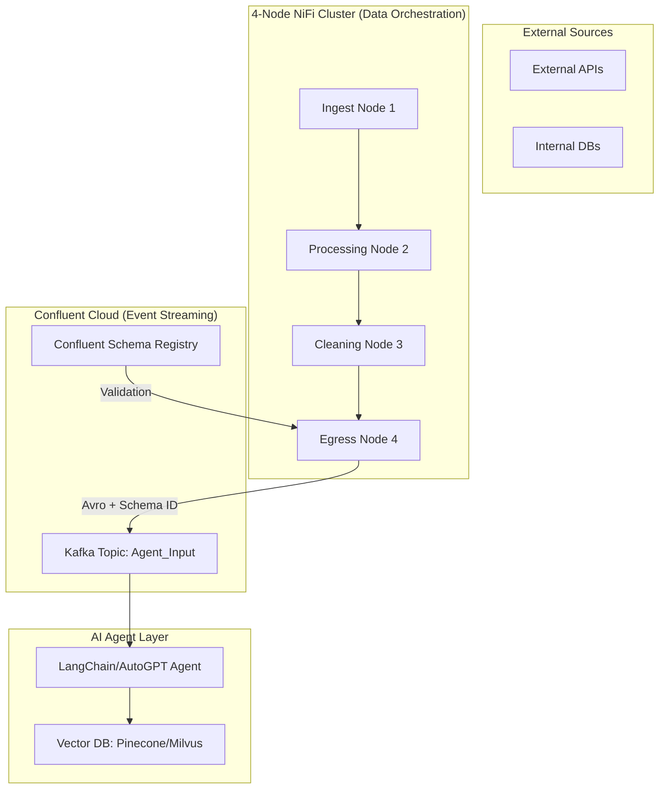

# Project Goal: 
Demonstrate a high-availability (4-node) NiFi cluster orchestrating multi-source data ingestion (SFTP/API), performing schema-based cleaning via JOLT, and streaming to Confluent Cloud using a centralized Schema Registry.

# NiFi-Confluent-Cloud-POC (AI Agentic Learning)

## Architecture Diagram




## 🚀 How to Run the POC

### 1. Prerequisites
* **Docker & Docker Compose** installed.
* **GH CLI** (optional, for repo management).
* **Confluent Cloud Account** (for API keys).

### 2. Spin up the 4-Node Cluster
From the project root, run:
```bash
docker-compose up -d
```


This will pull the latest NiFi and Zookeeper images and initialize the ensemble.

3. Access the UI
Once the containers are healthy, access the individual nodes at:

Node 1: https://localhost:8443/nifi

Node 2: https://localhost:8444/nifi (if ports are mapped sequentially)

4. Deploy the Agentic Logic
Open the NiFi UI.

Create a JoltTransformJSON processor.

Copy the contents of agentic_prep.jolt from this repo and paste it into the Jolt Specification property.

Use the sample_input.json to verify the transformation.

5. Clean Up
To stop the cluster and remove volumes:
```bash
docker-compose down -v
```


